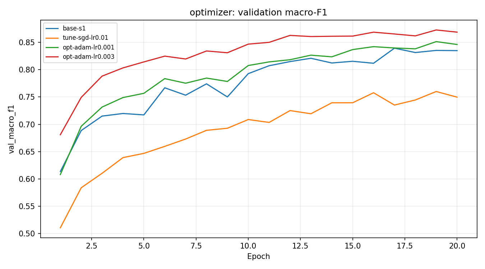
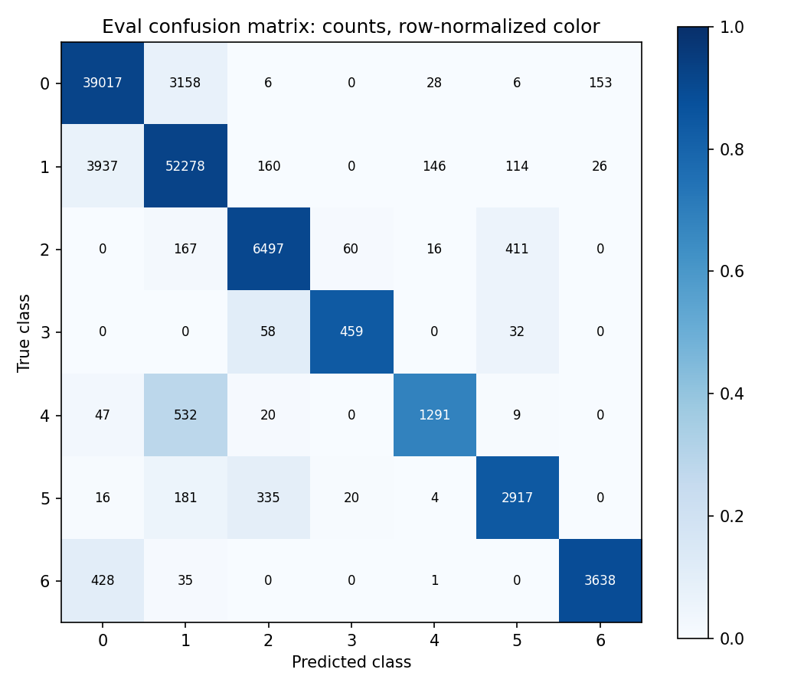

# Báo cáo Lab Day 1 — Nguyễn Thái Anh — 2A202602810

## 1. Thiết lập

Conda **base**, Python 3.13.11, PyTorch 2.10.0+cu128,
**NVIDIA GeForce RTX 3060**. Metadata gốc: 464 809 train / 116 203 eval;
tách val phân tầng seed 42: 371 847 học / 92 962 val. Chỉ chuẩn hoá 10 cột số
bằng phần học; giữ 44 cột one-hot. Eval chỉ mở sau chọn cấu hình bằng val.

Baseline `base-s1`: **54→256→128→7, 47 879 tham số**, ReLU, bias; CE, He mọi Linear,
SGD momentum .9, lr .05 chọn giữa .01/.05, batch 512, 20 epoch, không dropout/clip, FP32.
Giữ batch cuối; train loss ở eval mode trên 50 000 mẫu cố định, val toàn tập.
Chọn checkpoint theo val loss thấp nhất, xếp cấu hình bằng macro-F1 tại checkpoint đó.

## 2. Kiểm tra ban đầu và nhiễu

He CE bước 0 **2.269062**, logits đều **1.945910**:
ln(7) là mốc dự đoán đều; logits ngẫu nhiên He có thể lệch. Logits đúng (B,7), mọi gradient He khác 0.
Ghi nhớ 20 mẫu: CE **0.000004**, accuracy **1.000000**.
[Đường cong kiểm tra](figures/health_overfit20.png).

Lr .05 được chọn bằng val: F1=0.834926, so với .01 0.760059, khớp dự đoán hội tụ nhanh hơn. Train/val loss cuối=0.225932/0.246765; giảm nhưng có dao động và gap nhỏ. Accuracy mean±std=0.898112±0.001767; F1=0.834477±0.001914. Ba seed cho 2σ=0.003827, chỉ là ước lượng nhiễu thô. Accuracy baseline 0.900110 vượt mốc đa số 0.487597.
[So sánh seed](figures/compare_baseline.png). Noise ghi trong Seeds; sức khoẻ trong Legend.

## 3. Kết quả theo chủ đề — chỉ dùng validation

Cùng split, 20 epoch, seed 1. Mỗi biến thể đổi một yếu tố; Adam đổi optimizer và lr
có chủ đích, thử hai lr mỗi optimizer. Cặp lr cao có/không clip chỉ khác clip.
Bảng Excel có đủ 17 run, mỗi run một PNG cùng exp_id và JSON. Kỹ thuật khác chỉ một seed,
so với 2σ baseline chưa thay thế kiểm định nhiều seed của từng kỹ thuật.

| exp_id | val F1 | best epoch |
| --- | --- | --- |
| amp-bf16 | 0.844011 | 20 |
| amp-fp16 | 0.842037 | 20 |
| base-s1 | 0.834926 | 20 |
| batch-256 | 0.861197 | 20 |
| clip-normal | 0.832437 | 20 |
| drop-01 | 0.827773 | 20 |
| highlr-clip | 0.855244 | 16 |
| highlr-no-clip | 0.838530 | 20 |
| init-normal | 0.824713 | 20 |
| init-xavier | 0.828302 | 18 |
| init-zeros | 0.093650 | 15 |
| loss-mse | 0.696479 | 20 |
| opt-adam-lr0.001 | 0.846180 | 20 |
| opt-adam-lr0.003 | 0.868771 | 20 |
| tune-sgd-lr0.01 | 0.760059 | 19 |

**Loss — dự đoán CE phù hợp hơn MSE.** `loss-mse`: F1=0.696479, Δ=-0.138447, vượt 2σ=0.003827. Khớp dự đoán CE tốt hơn trong lịch này. MSE hồi quy logits về one-hot, mean B×7, scale gradient khác CE. Không so trị số hai loss; MSE chưa quét lr riêng.
CE gradient p−y; MSE 2(z−y)/(B×7), không 1/2, không softmax trước loss.
[Ảnh](figures/compare_loss.png).

**Optimizer — dự đoán moment thích nghi giúp Adam hội tụ.** `opt-adam-lr0.001`: F1=0.846180, Δ=+0.011255, vượt 2σ=0.003827. `opt-adam-lr0.003`: F1=0.868771, Δ=+0.033845, vượt 2σ=0.003827. Khớp dự đoán lợi ích moment thích nghi; Adam .003 cao nhất grid. SGD momentum thử .01/.05, Adam .001/.003; không suy ra optimizer luôn thắng. Betas=(.9,.999), eps=1e-8, weight decay=0.

**Batch — dự đoán batch nhỏ học thêm nhưng tốn thời gian.** `batch-256`: F1=0.861197, Δ=+0.026271, vượt 2σ=0.003827. Khớp dự đoán nhiều cập nhật đi kèm F1 cao hơn: 1453 so với 727 bước/epoch, 0.647809s so với 0.318971s. Cùng epoch khác số cập nhật, không quy toàn bộ lợi ích cho nhiễu gradient.
[Ảnh](figures/compare_hparam.png).

**Dropout — dự đoán q=.1 có thể underfit.** `drop-01`: F1=0.827773, Δ=-0.007153, vượt 2σ=0.003827. Gap val−train giảm 0.020833→0.009665, nhưng F1 giảm: khớp dự đoán dropout có thể underfit khi baseline chưa quá khớp mạnh. Cả hai loss đo lúc dropout tắt.
[Ảnh](figures/compare_dropout.png).

**Clipping — dự đoán c=p75 baseline kích hoạt một phần bước.** `clip-normal`: F1=0.832437, Δ=-0.002489, chưa vượt 2σ=0.003827. c=0.871056 từ p75 baseline, tỷ lệ clip TB=0.326272: khớp dự đoán clip kích hoạt. Ở lr ×10, có/không clip F1=0.855244/0.838530, Δ=+0.016713, vượt 2σ. Cả hai không diverged; không khẳng định clip cứu NaN. Clip chỉ giới hạn gradient và đổi quỹ đạo cập nhật.
Norm đo trước clip; unscale trước đo/clip nếu FP16. [Ảnh](figures/compare_clipping.png).

**Mixed precision — dự đoán lợi ích phụ thuộc overhead.** `amp-bf16`: F1=0.844011, Δ=+0.009085, vượt 2σ=0.003827. 0.395366s/epoch, FP32/AMP=0.806773; chậm hơn FP32. `amp-fp16`: F1=0.842037, Δ=+0.007112, vượt 2σ=0.003827. 0.445341s/epoch, FP32/AMP=0.716239; chậm hơn FP32. Khác kỳ vọng tăng tốc GEMM đơn giản, phù hợp dự đoán overhead có thể chi phối mạng nhỏ. Thời gian gồm validation FP32 và đồng bộ. FP16 scaler bỏ 5 bước overflow, norm lưu null; BF16 không cần scaler. Không ngoại suy sang GPU khác. FP16 là phép đo bổ sung, không chọn lại cấu hình cuối.

| exp_id | s/epoch | GPU peak MB |
| --- | --- | --- |
| base-s1 | 0.318971 | 150.647949 |
| amp-bf16 | 0.395366 | 150.647949 |
| amp-fp16 | 0.445341 | 150.648926 |

FP16 exponent hẹp nên cần scaler; BF16 exponent như FP32. Tham số và validation vẫn FP32.
Nếu chạy CPU, bộ nhớ là RSS cực đại tích luỹ, không so như VRAM từng run.
[Ảnh](figures/compare_amp.png).

**Init — dự đoán zeros chỉ học prior, normal nhỏ học chậm.** `init-zeros`: F1=0.093650, Δ=-0.741276, vượt 2σ=0.003827. `init-normal`: F1=0.824713, Δ=-0.010212, vượt 2σ=0.003827. `init-xavier`: F1=0.828302, Δ=-0.006624, vượt 2σ=0.003827. Khớp dự đoán zeros không học đặc trưng: chỉ bias cuối học prior, ReLU tại 0 chặn gradient lớp ẩn. Normal nhỏ làm tín hiệu suy giảm. Std ghi sau từng Linear, kể cả output. Hai lớp ẩn không đại diện mạng rất sâu; mọi kỹ thuật ở đây vẫn chỉ một seed.
Xavier Var=2/(fan-in+fan-out), He Var=2/fan-in, bias=0; std sau từng Linear trong Legend/JSON.
[Ảnh](figures/compare_init.png).

## 4. Đánh giá cuối trên eval và phân tích lỗi

Chọn **`opt-adam-lr0.003`** bằng val: Adam lr .003, M-base/CE/He, batch 512, 20 epoch,
không dropout/clip, FP32, seed 1. Không chọn seed 2/3 hoặc chỉnh cấu hình sau eval.
FP16 là phép đo bổ sung, loại khỏi chọn cấu hình đã khoá. Số từ script giảng viên:

| exp_id | val F1 | eval F1 | eval accuracy |
| --- | --- | --- | --- |
| base-s1 | 0.834926 | 0.839621 | 0.899082 |
| opt-adam-lr0.003 | 0.868771 | 0.873024 | 0.913032 |

Eval F1 tăng **+0.033402**; eval−val cuối
**+0.004253**. 2σ đo trên val baseline;
chưa đo nhiễu eval nhiều seed cuối nên chưa kết luận ý nghĩa thống kê.

| Lớp | support | precision | recall | F1 |
| --- | --- | --- | --- | --- |
| 0 | 42368 | 0.898078 | 0.920907 | 0.909349 |
| 1 | 56661 | 0.927721 | 0.922645 | 0.925176 |
| 2 | 7151 | 0.918174 | 0.908544 | 0.913334 |
| 3 | 549 | 0.851577 | 0.836066 | 0.843750 |
| 4 | 1899 | 0.868775 | 0.679831 | 0.762777 |
| 5 | 3473 | 0.836056 | 0.839908 | 0.837978 |
| 6 | 4102 | 0.953105 | 0.886884 | 0.918803 |

Khó nhất lớp **4**, F1 **0.762777**, nhầm sang lớp **1**
(532 mẫu). Mất cân bằng có thể góp phần; tương đồng địa hình là giả thuyết
chưa kiểm tra feature theo lớp. Sẽ thử CE trọng số lớp và kiểm tra bằng val.

## 5. Câu hỏi dẫn dắt

1. **Optimizer thắng?** Adam .003 cao nhất grid; lr chung dễ thiên lệch vì scale cập nhật khác.
Cần grid rộng và nhiều seed trước khi kết luận tổng quát.
2. **Dropout giúp khi chưa quá khớp?** Run này gap giảm nhưng F1 kém hơn; dùng khi
train tiếp tục tốt lên còn val xấu đi, chọn q bằng val.
3. **Clipping giải quyết gì?** Giới hạn gradient lớn; tỷ lệ clip chứng minh kích hoạt.
Không sửa dữ liệu, kiến trúc hoặc bảo đảm mọi lr cao ổn định.
4. **AMP nhanh hơn?** Không ở đây; kernel, đo gradient và đồng bộ có thể lấn lợi ích GEMM.
FP16 cần scaler vì exponent hẹp; BF16 thường không cần.
5. **Zeros/He/Xavier?** Zeros giữ đối xứng, ReLU(0) chặn lớp ẩn. He bù variance mất qua ReLU;
Xavier cân bằng fan-in/out, ảnh hưởng rõ hơn ở mạng sâu.
6. **Loss không giảm sau 2000 bước:** kiểm tra shape/dtype/nhãn và CE nhận logits;
thử ghi nhớ 20 mẫu, kiểm tra gradient/zero_grad/backward/step/optimizer;
kiểm tra lr, preclip norm và activation std để phân biệt học chậm, nổ hoặc chết gradient.

## 6. Hạn chế và điều bất ngờ

He bước 0 lệch ln(7), AMP chậm hơn, lr ×10 không diverged: ghi đúng số đo.
Ba seed baseline là ước lượng thô; kỹ thuật khác một seed, chọn trong nhiều cấu hình có thể
lạc quan trên val. Chưa quét đủ lr, q, weight decay; batch khác số cập nhật.
Nếu thêm thời gian: nhiều seed cuối và class weighting, chỉ chọn bằng val.

## 7. Phụ lục

Pipeline lần cuối 128.035823s. Nộp code/notebook có output, REPORT.md,
experiments.xlsx, predictions_eval.csv, eval_result.json, figures, results;
không dữ liệu/checkpoint/cache. Số phụ/per-class/confusion gắn exp_id trong Legend;
noise trong Seeds, cấu hình/metric trong Experiments. Nhận xét chi tiết ngay dưới mỗi nhóm notebook.
selection.json ghi quyết định trước eval; chạy lại dự đoán giống hệt thì dùng JSON chấm chính thức đã lưu.
