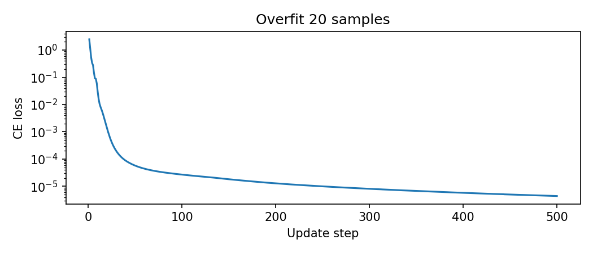
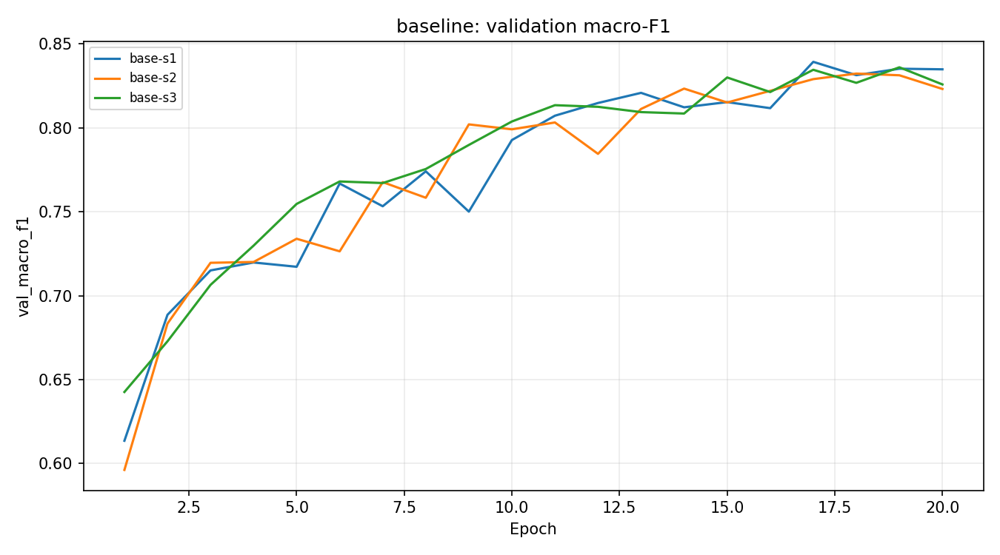
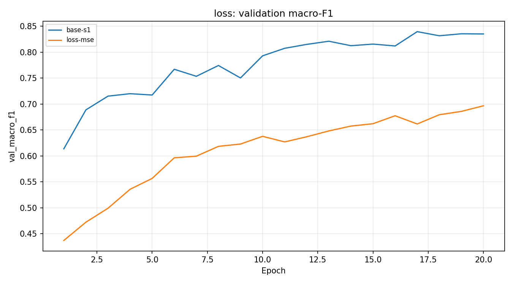
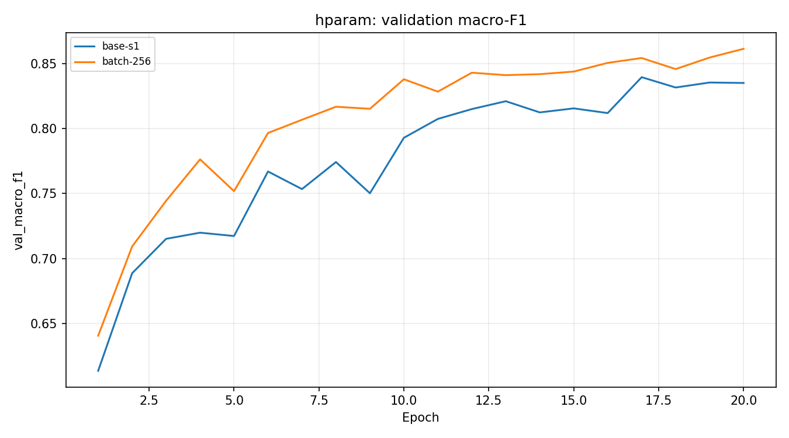
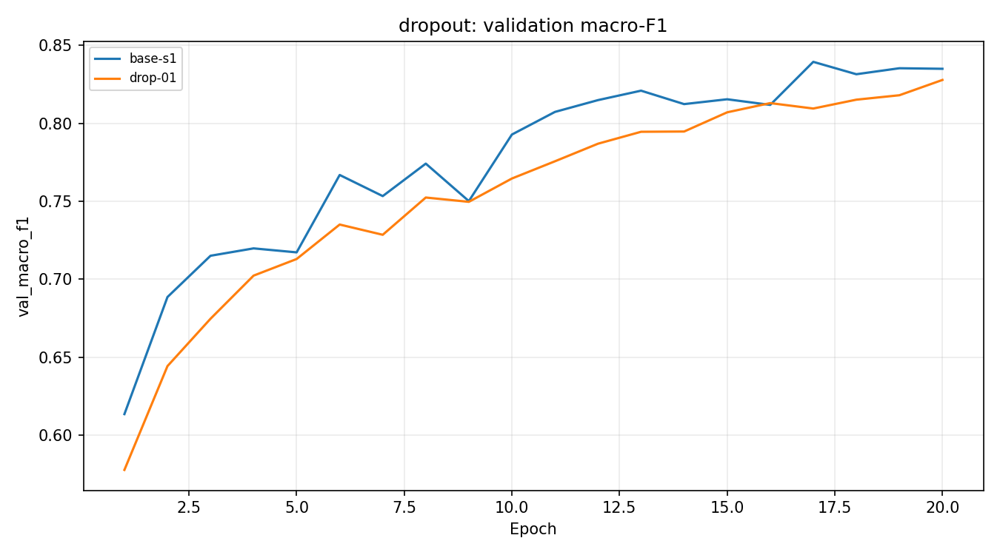
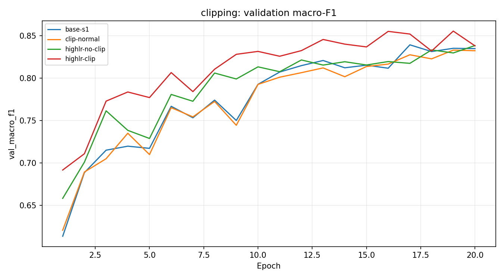
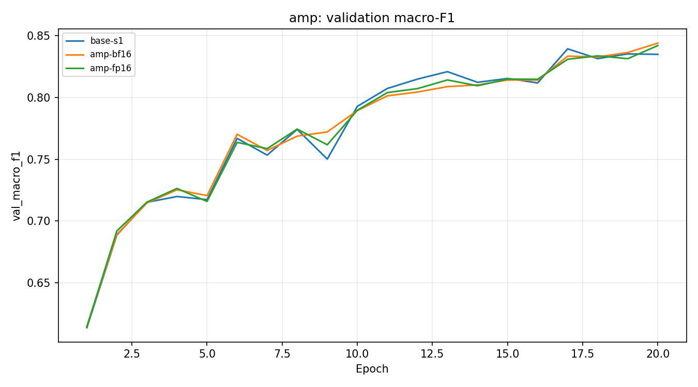
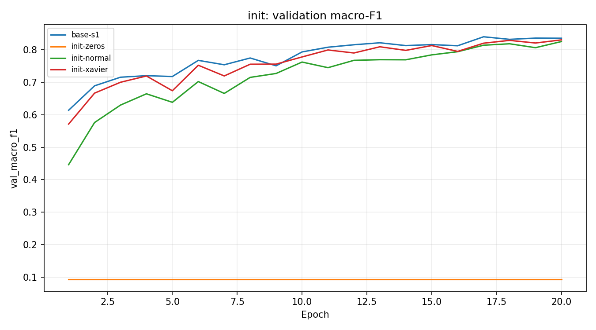

# Báo cáo Lab Day 1 — Nguyễn Thái Anh — 2A202602810

## 1. Thiết lập

Chạy trực tiếp trong Conda **base**, Python 3.13.11, PyTorch 2.10.0+cu128,
thiết bị **NVIDIA GeForce RTX 3060**. Forest CoverType chia theo metadata gốc: 464 809 train / 116 203 eval.
Từ train, tách phân tầng seed 42 thành 371 847 mẫu học và 92 962 mẫu validation.
Chỉ 10 cột liên tục được chuẩn hoá bằng thống kê của 371 847 mẫu học; giữ 44 cột one-hot.
Tập eval chỉ được mở sau khi ghi quyết định cấu hình vào `selection.json`.

Baseline `base-s1`: M-base 54→256→128→7, **47 879 tham số**, ReLU, bias;
CE, He cho mọi Linear, SGD momentum 0.9, lr **0.05**, batch 512,
20 epoch, dropout 0, không clip, FP32. Lr chọn bằng val trong 0.01 và 0.05.
Train loss đo ở eval mode trên 50 000 mẫu cố định seed 42; val dùng toàn tập.
Giữ batch cuối; không scheduler. Chọn checkpoint có **val loss thấp nhất**;
so cấu hình bằng macro-F1 tại checkpoint đó. FP16 là phép đo bổ sung, loại khỏi chọn cấu hình cuối; cấu hình cuối giữ nguyên sau khi chấm eval. Không dùng eval chọn lr, epoch hoặc seed.
Mốc đoán lớp đa số trên val: **0.487597** (`base-s1`, phần bằng chứng trong Legend).
Đã thử đủ bảy chủ đề: loss, optimizer, hyper-parameter, dropout, clipping, mixed precision, init.

## 2. Kiểm tra ban đầu và nhiễu

| Kiểm tra (`base-s1`, bằng chứng Legend) | Kết quả |
| --- | --- |
| Parameters / logits shape | 47879 / (B,7) |
| He CE bước 0 | 2.269062 |
| CE với logits đều bằng 0 | 1.945910 |
| Ghi nhớ 20 mẫu: loss / accuracy | 0.000004 / 1.000000 |
| Mọi gradient He khác 0 | True |
| Baseline val accuracy mean ± sample std | 0.898112 ± 0.001767 |
| Baseline val macro-F1 mean ± sample std | 0.834477 ± 0.001914 |
| Ngưỡng nhiễu 2σ | 0.003827 |

Loss bước 0 của He lớn hơn ln(7): logits ngẫu nhiên chưa đều. Không coi ln(7) là
đẳng thức cho mọi khởi tạo. Phép thử logits bằng 0 xác nhận mốc này; kiểm tra gradient
và ghi nhớ 20 mẫu xác nhận vòng lặp cập nhật hoạt động. Std kích hoạt sau từng Linear
được ghi trong JSON và Legend. Baseline vượt mốc đa số; loss đầu/cuối train là
0.500391/0.225932, val là
0.499448/0.246765; checkpoint tốt nhất epoch 20.
Ba seed `base-s1`, `base-s2`, `base-s3` cho ước lượng nhiễu mẫu, không phải kiểm định thống kê.

## 3. Kết quả theo chủ đề (chỉ dùng validation)

### 3.1 CE và MSE

**Dự đoán trước:** CE phù hợp phân loại hơn MSE và hội tụ tốt hơn trong cùng lịch học.
MSE ở đây lấy trung bình trên toàn bộ B×7 phần tử giữa **logits thô** và one-hot,
không hệ số 1/2, không dùng softmax. Không so trị số CE với MSE.

| exp_id | lr | val accuracy | val macro-F1 | best epoch |
| --- | --- | --- | --- | --- |
| base-s1 | 0.05 | 0.900110 | 0.834926 | 20 |
| loss-mse | 0.05 | 0.854607 | 0.696479 | 20 |

`loss-mse` có val macro-F1 0.696479, thấp hơn `base-s1` 0.138447; chênh lệch vượt ngưỡng 2σ=0.003827. Đây là so sánh một seed của kỹ thuật với baseline; chưa chứng minh tính ổn định qua nhiều seed. Kết quả khớp dự đoán về CE trong cấu hình này. CE có gradient theo logits p−y; MSE có gradient 2(z−y)/(B×7),
phạt logits theo mục tiêu hồi quy. Cùng lr không đảm bảo hai loss đã được chỉnh tối ưu;
kết quả chỉ mô tả lịch huấn luyện này, không chứng minh CE luôn tốt hơn.

### 3.2 Optimizer và độ nhạy lr

**Dự đoán trước:** moment thích nghi giúp Adam hội tụ nhanh ở lr 0.001/0.003;
SGD momentum cần lr riêng. Adam dùng betas=(0.9,0.999), eps=1e-8, weight decay=0.
SGD momentum thử hai lr ở Part 2; Adam thử hai lr ở Part 3. Các run Adam đổi
optimizer **và lr** có chủ đích để so ở lr tốt nhất của mỗi optimizer.

| exp_id | lr | val accuracy | val macro-F1 | best epoch |
| --- | --- | --- | --- | --- |
| base-s1 | 0.05 | 0.900110 | 0.834926 | 20 |
| tune-sgd-lr0.01 | 0.01 | 0.867968 | 0.760059 | 19 |
| opt-adam-lr0.001 | 0.001 | 0.902950 | 0.846180 | 20 |
| opt-adam-lr0.003 | 0.003 | 0.914546 | 0.868771 | 20 |

Trong grid đã đo, SGD tốt nhất là `base-s1`, Adam tốt nhất là
`opt-adam-lr0.003`; cao nhất trong hai là **`opt-adam-lr0.003`**.
`opt-adam-lr0.003` có val macro-F1 0.868771, cao hơn `base-s1` 0.033845; chênh lệch vượt ngưỡng 2σ=0.003827. Đây là so sánh một seed của kỹ thuật với baseline; chưa chứng minh tính ổn định qua nhiều seed. Momentum tích luỹ hướng cập nhật; Adam chia gradient theo
ước lượng moment bậc hai nên phản ứng khác với lr. Hai lr mỗi optimizer chưa phải
quét đầy đủ; không suy ra thuật toán thắng tuyệt đối hoặc kết luận về AdamW chưa chạy.

### 3.3 Hyper-parameter

**Dự đoán trước:** batch 256 tăng số cập nhật và có thể học thêm chi tiết, đổi lại thời gian.
Giữ lr, seed và số epoch; batch 512 có 727 cập nhật/epoch, batch 256 có 1 453.
Không đổi kiến trúc trong thí nghiệm này.

| exp_id | lr | val accuracy | val macro-F1 | best epoch |
| --- | --- | --- | --- | --- |
| base-s1 | 0.05 | 0.900110 | 0.834926 | 20 |
| batch-256 | 0.05 | 0.910555 | 0.861197 | 20 |

`batch-256` có val macro-F1 0.861197, cao hơn `base-s1` 0.026271; chênh lệch vượt ngưỡng 2σ=0.003827. Đây là so sánh một seed của kỹ thuật với baseline; chưa chứng minh tính ổn định qua nhiều seed. Batch nhỏ tăng cả nhiễu gradient và số cập nhật;
so cùng epoch là so cùng số lượt dữ liệu, không cùng số bước optimizer.

### 3.4 Dropout

**Dự đoán trước:** q=0.1 có thể làm giảm khả năng học nếu baseline chưa quá khớp mạnh.
`drop-01` có val macro-F1 0.827773, thấp hơn `base-s1` 0.007153; chênh lệch vượt ngưỡng 2σ=0.003827. Đây là so sánh một seed của kỹ thuật với baseline; chưa chứng minh tính ổn định qua nhiều seed. Khoảng cách loss val−train cuối baseline **0.020833**,
`drop-01` **0.009665**. Kết quả khớp dự đoán: dropout làm F1 giảm dù gap nhỏ hơn. Cả hai loss đều đo khi dropout tắt nên so được.
Dropout thêm nhiễu, ngăn các neuron phụ thuộc nhau; khoảng cách giảm tự nó chưa đủ
chứng minh cải thiện nếu cả train/val đều kém hơn. Chưa quét q hoặc nhiều seed dropout.

### 3.5 Clipping

**Dự đoán trước:** c từ percentile 75 gradient baseline sẽ cắt một phần bước;
clip có thể giảm gai ở lr cao nhưng không đảm bảo cứu learning rate quá lớn.
Gradient ghi **trước clip**, FP16 unscale trước đo.

| exp_id | lr | c | tỷ lệ bước clip TB | max gradient/epoch | val F1 |
| --- | --- | --- | --- | --- | --- |
| clip-normal | 0.05 | 0.871056 | 0.326272 | 2.891285 | 0.832437 |
| highlr-no-clip | 0.5 | N/A | 0.000000 | 4.473457 | 0.838530 |
| highlr-clip | 0.5 | 0.871056 | 0.000757 | 2.998623 | 0.855244 |

`clip-normal` có val macro-F1 0.832437, thấp hơn `base-s1` 0.002489; chênh lệch chưa vượt ngưỡng 2σ=0.003827. Đây là so sánh một seed của kỹ thuật với baseline; chưa chứng minh tính ổn định qua nhiều seed. Cặp lr cao giữ mọi cấu hình giống nhau trừ clip.
Nếu clip không nâng val F1, không gọi là cứu được huấn luyện: clipping chỉ giới hạn
chuẩn gradient, còn bước cập nhật phụ thuộc lr và momentum. Cờ diverged và đường cong
cung cấp bằng chứng thay vì mặc định lr cao phải sinh NaN.
Hai run lr cao đều không diverged, khác dự đoán rằng lr ×10 có thể làm huấn luyện hỏng.
F1 có clip−không clip = **+0.016713**, vượt 2σ baseline.
Clipping ở lr cao chỉ tác động ít bước nhưng đổi quỹ đạo cập nhật; đây là quan sát một seed,
không chứng minh clip cần thiết mọi lr.

### 3.6 Mixed precision

**Dự đoán trước:** GPU có thể tăng tốc phép nhân ở FP16/BF16, nhưng MLP nhỏ và chi phí
kernel/đo gradient có thể làm lợi ích nhỏ. Tham số và đánh giá vẫn FP32;
FP16 dùng GradScaler, BF16 không cần scaler. Cả hai unscale/clip theo thứ tự đúng.

| exp_id | precision | s/epoch | GPU peak MB hoặc RSS | scaler skips | val F1 |
| --- | --- | --- | --- | --- | --- |
| base-s1 | fp32 | 0.318971 | 150.647949 | 0 | 0.834926 |
| amp-bf16 | bf16 | 0.395366 | 150.647949 | 0 | 0.844011 |
| amp-fp16 | fp16 | 0.445341 | 150.648926 | 5 | 0.842037 |

`amp-bf16`: tỷ số thời gian FP32/AMP = **0.806773** (chậm hơn FP32 trong phép đo này). `amp-bf16` có val macro-F1 0.844011, cao hơn `base-s1` 0.009085; chênh lệch vượt ngưỡng 2σ=0.003827. Đây là so sánh một seed của kỹ thuật với baseline; chưa chứng minh tính ổn định qua nhiều seed.

`amp-fp16`: tỷ số thời gian FP32/AMP = **0.716239** (chậm hơn FP32 trong phép đo này). `amp-fp16` có val macro-F1 0.842037, cao hơn `base-s1` 0.007112; chênh lệch vượt ngưỡng 2σ=0.003827. Đây là so sánh một seed của kỹ thuật với baseline; chưa chứng minh tính ổn định qua nhiều seed.

FP16 có khoảng biểu diễn hẹp, cần nhân loss để tránh underflow gradient;
BF16 có số bit exponent bằng FP32 nhưng mantissa ít hơn, thường không cần scaler.
Khi FP16 có gradient không hữu hạn do scale, GradScaler bỏ cập nhật và giảm scale;
không coi riêng hiện tượng này là model diverged. Các bước này lưu norm=null trong JSON,
grad_norm mean/max chỉ tính bước hữu hạn; tổng bước thử và số skip được ghi riêng trong Legend.
Thời gian gồm huấn luyện, đo train/val FP32 và đồng bộ GPU. Nếu chạy CPU, peak_mem_MB
là RSS cực đại tích luỹ, không thể dùng để kết luận tiết kiệm bộ nhớ từng run.
Chỉ áp dụng kết quả tốc độ cho phần cứng này; không ngoại suy sang GPU khác.

### 3.7 Khởi tạo

**Dự đoán trước:** zeros chỉ học bias đầu ra; normal std=.01 có tín hiệu nhỏ;
He duy trì variance qua ReLU tốt hơn trong lý thuyết, Xavier có thể vẫn học tốt ở mạng nông.
Xavier dùng Var=2/(fan_in+fan_out); He dùng Var=2/fan_in cho **mọi** Linear, bias=0.

| exp_id | loss bước 0 | std sau các Linear | val F1 |
| --- | --- | --- | --- |
| base-s1 | 2.269062 | 0.666205, 0.646387, 0.593344 | 0.834926 |
| init-zeros | 1.945910 | 0.000000, 0.000000, 0.000000 | 0.093650 |
| init-normal | 1.945996 | 0.034617, 0.003800, 0.000279 | 0.824713 |
| init-xavier | 2.022176 | 0.278051, 0.220274, 0.196886 | 0.828302 |

Zeros giữ đối xứng; ReLU tại 0 có đạo hàm 0, gradient các lớp ẩn không chảy;
bias output vẫn học prior lớp nên loss giảm không đồng nghĩa học được đặc trưng.
Normal nhỏ có kích hoạt suy giảm. Mạng chỉ hai lớp ẩn nên không đại diện hiện tượng
mạng hàng chục lớp; không mặc định He phải thắng Xavier từ một seed.
`init-xavier` có val macro-F1 0.828302, thấp hơn `base-s1` 0.006624; chênh lệch vượt ngưỡng 2σ=0.003827. Đây là so sánh một seed của kỹ thuật với baseline; chưa chứng minh tính ổn định qua nhiều seed.
`init-normal` có val macro-F1 0.824713, thấp hơn `base-s1` 0.010212; chênh lệch vượt ngưỡng 2σ=0.003827. Đây là so sánh một seed của kỹ thuật với baseline; chưa chứng minh tính ổn định qua nhiều seed.

## 4. Đánh giá cuối trên eval

Chọn **`opt-adam-lr0.003`** bằng val, seed 1; không chọn seed 2/3 làm mô hình cuối.
Cấu hình: adam, lr=0.003, batch=512,
hidden=(256, 128), loss=ce, dropout=0.0,
clip=None, init=he, precision=fp32.
Chỉ đánh giá `base-s1` và cấu hình cuối, lấy số nguyên gốc từ script giảng viên.

| Cấu hình | val F1 | eval F1 | eval accuracy |
| --- | --- | --- | --- |
| base-s1 | 0.834926 | 0.839621 | 0.899082 |
| opt-adam-lr0.003 | 0.868771 | 0.873024 | 0.913032 |

Chênh lệch eval macro-F1 cuối−baseline = **+0.033402**;
độ lệch eval−val của cấu hình cuối = **+0.004253**.
Ngưỡng 2σ ở phần 2 đo trên **val baseline**, không phải nhiễu eval của cấu hình cuối;
chưa có nhiều seed cuối trên eval nên không khẳng định ý nghĩa thống kê của cải thiện eval.

### 4.1 Phân tích lỗi theo lớp

| Lớp | support | precision | recall | F1 |
| --- | --- | --- | --- | --- |
| 0 | 42368 | 0.898078 | 0.920907 | 0.909349 |
| 1 | 56661 | 0.927721 | 0.922645 | 0.925176 |
| 2 | 7151 | 0.918174 | 0.908544 | 0.913334 |
| 3 | 549 | 0.851577 | 0.836066 | 0.843750 |
| 4 | 1899 | 0.868775 | 0.679831 | 0.762777 |
| 5 | 3473 | 0.836056 | 0.839908 | 0.837978 |
| 6 | 4102 | 0.953105 | 0.886884 | 0.918803 |

Lớp khó nhất là **4**, F1 **0.762777**, thường bị nhầm sang
lớp **1** (532 mẫu). Tập train có 6075 mẫu
lớp 4 và 181312 mẫu lớp 1 (bằng chứng Legend).
Mất cân bằng có thể ảnh hưởng ranh giới; sự giống nhau về địa hình là giả thuyết,
chưa đo phân bố feature theo cặp lớp nên không coi là kết luận. Lần sau thử CE trọng số lớp
và kiểm tra trên val; không dùng eval để chỉnh cấu hình trong bài này.

## 5. Câu hỏi dẫn dắt

1. Trong grid đã thử, `opt-adam-lr0.003` có val F1 cao nhất giữa SGD và Adam.
   So một lr chung không công bằng vì scale cập nhật khác; kết luận chỉ giới hạn grid và một seed kỹ thuật.
2. Dropout không đảm bảo giúp khi chưa quá khớp: đối chiếu val F1 và gap loss ở mục 3.4.
   Dùng khi train tiếp tục cải thiện trong khi val xấu đi, rồi chọn q bằng val.
3. Clipping chặn chuẩn gradient lớn; tỷ lệ clip và max gradient trước clip ở 3.5 chứng minh nó có kích hoạt.
   Nó không sửa nhãn, không tăng năng lực model và không đảm bảo cứu mọi lr cao.
4. Tốc độ AMP chỉ kết luận theo bảng thời gian 3.6. Mạng nhỏ chịu overhead gọi kernel và đồng bộ;
   FP16/BF16 có thể ít lợi ích hoặc chậm hơn dù phép nhân lý thuyết nhanh hơn.
5. Zeros làm ReLU có gradient 0 ở lớp ẩn và giữ neuron đối xứng, chỉ prior ở output thay đổi.
   He bù variance mất qua ReLU; Xavier cân bằng fan-in/fan-out; ảnh hưởng lớn hơn ở mạng sâu.
6. **Loss không giảm sau 2 000 bước:** (a) kiểm tra shape/dtype/nhãn 0..6 và CE nhận logits thô;
   (b) thử ghi nhớ 20 mẫu, in gradient từng tham số, kiểm tra zero_grad/backward/step và optimizer nhận đủ tham số;
   (c) nhìn preclip gradient, lr và std kích hoạt để phân biệt lr quá nhỏ, nổ gradient hoặc init làm gradient chết.
   Chỉ đổi kiến trúc sau khi dữ liệu và cập nhật vượt qua các phép thử này.

## 6. Hạn chế và điều bất ngờ

Loss He ban đầu không bằng ln(7), phù hợp logits ngẫu nhiên; không che giấu phép đo.
Ba seed baseline cho ước lượng nhiễu còn thô; kỹ thuật khác chỉ một seed và chọn tốt nhất
trong nhiều cấu hình có thể lạc quan trên validation. Cùng epoch nhưng batch khác nhau
làm khác số cập nhật. Chưa quét đầy đủ lr, dropout hoặc weight decay; không chạy AdamW.
Không giả định clipping cứu được lr cao hay AMP chắc chắn tăng tốc; dùng số đo ở 3.5–3.6.
Giới hạn bộ nhớ CPU/GPU khác nhau được ghi đúng trong JSON và notes Excel.
Nếu có thêm thời gian, chạy nhiều seed cho cấu hình cuối và các ứng viên gần nhau,
quét lr rộng hơn, thử loss có trọng số và đánh giá độ nhạy split bằng train/val.

## 7. Phụ lục

Thời gian pipeline đến lúc lập báo cáo: **128.035823 giây** (Legend, `opt-adam-lr0.003`).
Nộp REPORT.md, experiments.xlsx (giữ bốn sheet và công thức), predictions_eval.csv,
eval_result.json, figures, results và toàn bộ code trong code/, notebook có output.
Mọi số đo sức khoẻ, clip, activation, thời gian và per-class nằm trong **Legend**
với exp_id; số chính mỗi run trong **Experiments**, nhiễu trong **Seeds**.
`selection.json` và `health_checks.json` giữ dấu vết quyết định/kiểm tra.
Không nộp dữ liệu, trọng số, cache. Mỗi dòng Experiments có một ảnh cùng exp_id;
các ảnh compare, health và confusion là bằng chứng bổ sung.
FP16 được thêm như phép đo precision bổ sung và loại khỏi chọn cấu hình; không tinh chỉnh
mô hình sau khi thấy eval. Khi chạy lại với dự đoán giống hệt, notebook dùng lại JSON chấm chính thức.
